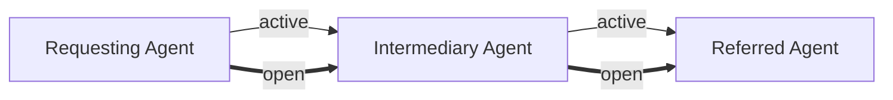

# Referral Relay Seed Graph

This static Mermaid graph was generated from `seed_referral_relay_scenario` using the read-only graph snapshot and Mermaid renderer.

```mermaid
flowchart LR
  agent_1["Requesting Agent"]
  agent_2["Intermediary Agent"]
  agent_3["Referred Agent"]

  agent_1 -->|"active"| agent_2
  agent_2 -->|"active"| agent_3
  agent_1 ==>|"open"| agent_2
  agent_2 ==>|"open"| agent_3
```
